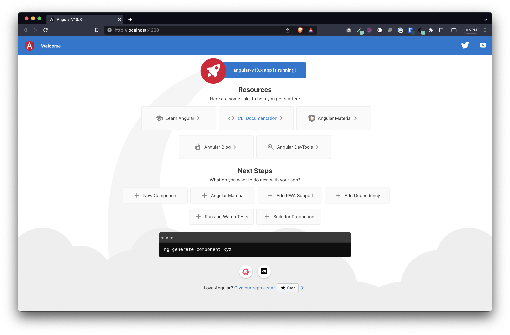
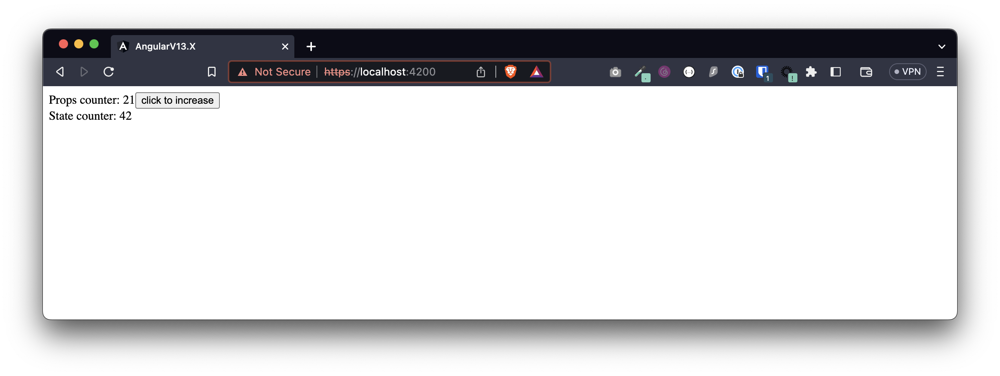
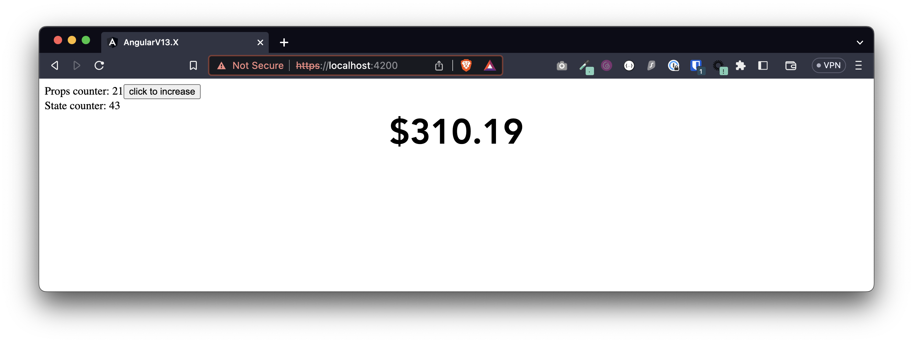

# AngularV13.X & GoodData.UI@v8.12

This project was created with `ng new angular-v13.x` on 2023-04-05, `ng --version`:
- Angular CLI: 13.3.11
- Node: 16.13.0
- Package Manager: npm 8.1.0

## Steps taken to create this projects

1. Uninstall previously globally installed Angular CLIs if any
1. `npm install -g @angular/cli@13`
1. `ng new angular-v13.x`
    1. `? Would you like to add Angular routing? No`
    1. `? Which stylesheet format would you like to use? SCSS`
1. `cd angular-v13.x`

Optional: Test run the app by running `npm start`.



1. Introduce React into Angular app
    1. `npm i --save react@17 react-dom@17`
    1. `npm i --save -D @types/react@17 @types/react-dom@17`
    1. Add `"jsx": "react"` into `compilerOptions` in `tsconfig.json`
1. Create `src/CustomReactComponent.tsx`
1. Create `src/CustomReactComponentWrapper.tsx`
1. Replace the contents of `src/app/app.component.html` with
    ```
    <div id="myReactComponentContainer">
        <app-my-component [counter]="counter" (componentClick)="handleOnClick($event)"></app-my-component>
    </div>
    ```
1. Update the contents of `src/app/app.components.ts` accordingly
    ```
    export class AppComponent {
        ...
        counter = 21;

        handleOnClick(stateCounter: number) {
            this.counter++;
        }
    }
    ```
1. Update the contents of `src/app/app.module.ts` accordingly
    ```
    ...
    import { CustomReactComponentWrapperComponent } from '../CustomReactComponentWrapper';

    @NgModule({
        declarations: [
            AppComponent,
            CustomReactComponentWrapperComponent
        ],
        ...
    })
    export class AppModule { }
    ```
1.

Optional: Test run the app again by running `npm start`.



1. Introduce GoodData.UI into Angular app
    1. `npm i --save @gooddata/sdk-backend-tiger@^8.12.0 @gooddata/sdk-model@^8.12.0 @gooddata/sdk-ui@^8.12.0 @gooddata/sdk-ui-charts@^8.12.0`
    1. Add `"skipLibCheck": true` into `compilerOptions` in `tsconfig.json`
    1. Add `(window as any).global = window;` to `src/polyfills.ts`
1. Update `"start": "ng serve --ssl"` in `scripts` in `package.json`
1. Add `https://localhost:4200` to allowed CORS origins
1. Render the GoodData.UI Headline component in `src/CustomReactComponent.tsx` like this
    ```
    import { Headline } from '@gooddata/sdk-ui-charts';
    import { newMeasure, idRef } from '@gooddata/sdk-model';
    import tigerFactory, { TigerTokenAuthProvider } from '@gooddata/sdk-backend-tiger';
    ...
    const backend = tigerFactory({
        hostname: 'https://jirizajic.demo.cloud.gooddata.com/',
    }).withAuthentication(new TigerTokenAuthProvider('mysupersecrettoken'));
    ...
    <Headline
        backend={backend}
        workspace="ecommerce-parent"
        primaryMeasure={newMeasure(idRef('average_price_of_products', 'measure'))}
    />
    ```
1. Include the styling in `src/CustomReactComponentWrapper.tsx` like this
    ```
    @Component({
        ...
        styleUrls: ['../node_modules/@gooddata/sdk-ui-charts/styles/scss/main.scss'],
        ...
    })
    ```

Run the app by running `npm start` and pray 🙏



## Troubleshooting

If you run into `react-intl` errors, do `npm i --save react-intl@5` and then wrap the GoodData.UI component in `<IntlProvider locale={navigator.language}><Headline ... /></IntlProvider>`.

---

This project was generated with [Angular CLI](https://github.com/angular/angular-cli) version 13.3.11.

## Development server

Run `ng serve` for a dev server. Navigate to `http://localhost:4200/`. The application will automatically reload if you change any of the source files.

## Code scaffolding

Run `ng generate component component-name` to generate a new component. You can also use `ng generate directive|pipe|service|class|guard|interface|enum|module`.

## Build

Run `ng build` to build the project. The build artifacts will be stored in the `dist/` directory.

## Running unit tests

Run `ng test` to execute the unit tests via [Karma](https://karma-runner.github.io).

## Running end-to-end tests

Run `ng e2e` to execute the end-to-end tests via a platform of your choice. To use this command, you need to first add a package that implements end-to-end testing capabilities.

## Further help

To get more help on the Angular CLI use `ng help` or go check out the [Angular CLI Overview and Command Reference](https://angular.io/cli) page.
