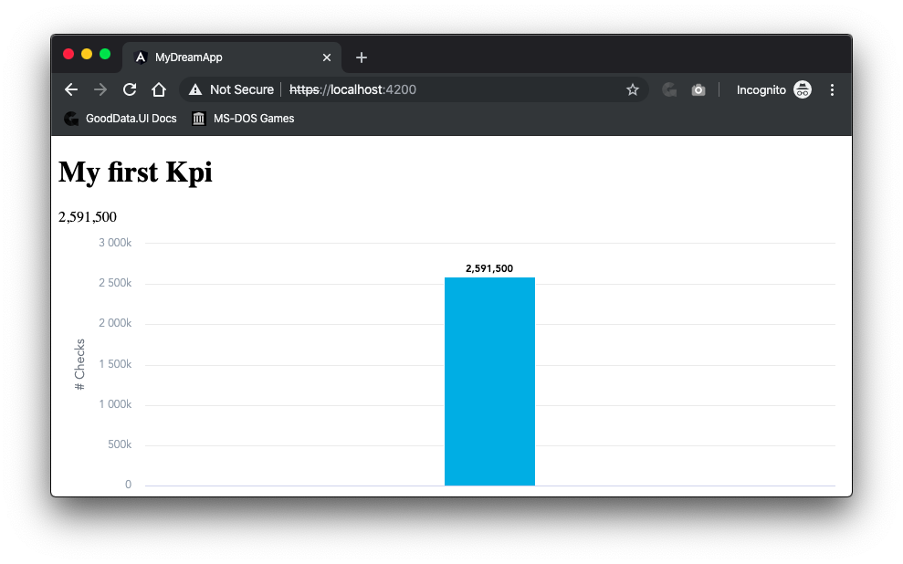

# Angular v8.x

This project was generated with [Angular CLI](https://github.com/angular/angular-cli) version 8.3.20.

## Getting Started

This has been tested with npm v6.9.0 and Node v10.16.3.

### Proxy

This demo will proxy all `/gdc/*` requests to https://developer.na.gooddata.com and is configured to run against project (workspace) id `kf0vsjlf9mll0osg6hmtppgm1nkjsi9r` ([GoodDataUI Examples](https://gooddata-examples.herokuapp.com/)).

### Authentication

There is no UI for authentication. To authenticate, open console in Chrome DevTools and use exposed [GoodData.UI](https://sdk.gooddata.com/gooddata-ui/docs/about_gooddataui.html) ([gooddata-js](https://github.com/gooddata/gooddata-js)) by typing in the following line:

```gooddata.user.login('jiri.zajic@gooddata.com', '64dlkaq9').then(console.log)```

## Development server

Run `yarn start` for a dev server. Navigate to `http://localhost:4200/`. The app will automatically reload if you change any of the source files.

## Code scaffolding

Run `ng generate component component-name` to generate a new component. You can also use `ng generate directive|pipe|service|class|guard|interface|enum|module`.

## Build

Run `ng build` to build the project. The build artifacts will be stored in the `dist/` directory. Use the `--prod` flag for a production build.

## Running unit tests

Run `ng test` to execute the unit tests via [Karma](https://karma-runner.github.io).

## Running end-to-end tests

Run `ng e2e` to execute the end-to-end tests via [Protractor](http://www.protractortest.org/).

## Further help

To get more help on the Angular CLI use `ng help` or go check out the [Angular CLI README](https://github.com/angular/angular-cli/blob/master/README.md).

## Screenshot


