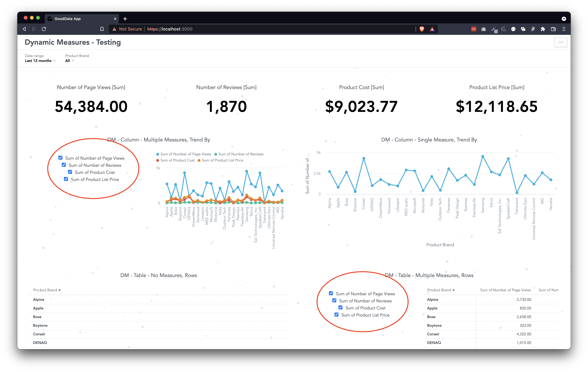

# GoodData.UI Dashboard Dynamic Measures

This app adds new functionality to insights on a dashboard. Insights with multiple measures get a dedicated measure switcher that allows to hide some of the measures.

## Rules

* Insight must have a bucket where `localIdentifier === 'measures'`
* Measures bucket must be the first bucket
* Insight must have 2 or more measures

## Ideas for improvements

* Activate the functionality based on insight title prefix
* Keep original legend colors
* Disable checkboxes while insight is loading
* Better CSS styling

## Notes

* Watch for unique IDs in custom widgets
* Prefix unique IDs in custom widgets with widget ID, not insight ID
* It would be handy to get a color palette as a param

## Tests

All testing is done manully. No united tests included.

* No measures, single measure, multiple measures
* All insight types, differently filled buckets
* Totals
* Very fast clicking on checkboxes

## Screenshot

> This project was bootstrapped with [GoodData.UI Accelerator Toolkit](https://sdk.gooddata.com/gooddata-ui/docs/create_new_application.html).
