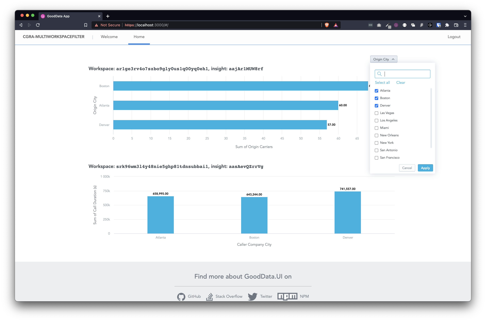

# Filtering Across Multiple Workspaces

This app demonstrates how you can implement an attribute filter that will apply to multiple insights in different workspaces.

## Backend

This app is designed to connect to workspace `ar1ge3rv4o7szbo9gly0us1q00yq0eh1` (GoodFlights Demo) and `srk96wm3l4y48nie5ghp81tdnsubbai1` (Call Center Demo) on https://demos.na.gooddata.com/ domain.

## How to run locally

* `yarn install`
* `yarn start`

## Screenshot

---

This project was bootstrapped with [GoodData.UI Accelerator Toolkit](https://sdk.gooddata.com/gooddata-ui/docs/create_new_application.html).
