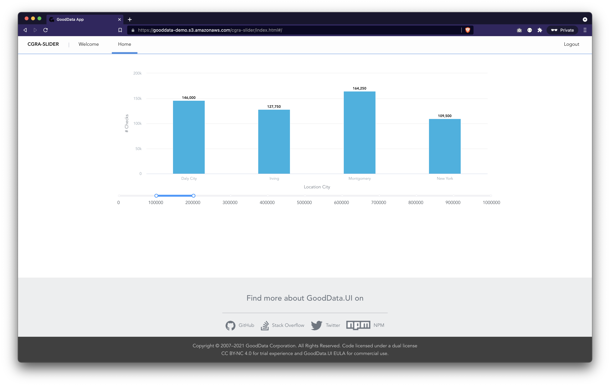

# Slider

This demonstrates how you can easily implement a [Measure Value Filter](https://help.gooddata.com/doc/enterprise/en/dashboards-and-insights/analytical-designer/visualize-your-data/filters-in-analytical-designer/filter-insights-by-measure-values) using [RSuite RangeSlider](https://rsuitejs.com/components/slider) component.

## Backend

This app is designed to connect to workspace `xms7ga4tf3g3nzucd8380o2bev8oeknp` on https://live-examples-proxy.herokuapp.com/ domain, and does not require authentication.

## Live demo

This app is deployed at https://gooddata-demo.s3.amazonaws.com/cgra-slider/index.html.

## How to run locally

* `yarn install`
* `yarn start`

## Screenshot

---

This project was bootstrapped with [GoodData.UI Accelerator Toolkit](https://sdk.gooddata.com/gooddata-ui/docs/create_new_application.html).
