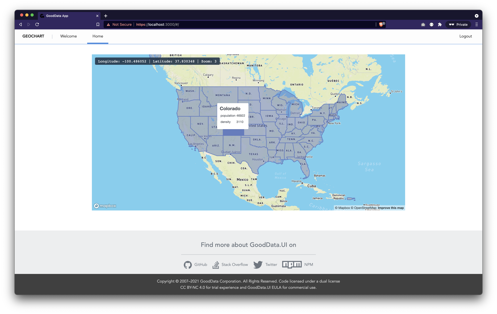

# GeoChart

This demonstrates how you can feed data from the [GoodData](https://www.gooddata.com/) platform to a custom [MapBox](https://www.mapbox.com/) geo chart.

## Backend

This app is designed to connect to domain https://developer.na.gooddata.com/, workspace `xms7ga4tf3g3nzucd8380o2bev8oeknp`.

For access, you can register at https://gooddata-examples.herokuapp.com/.

## Live demo

This app is deployed at https://gooddata-poc.s3.amazonaws.com/geochart/index.html.

## How to run locally

* `yarn install`
* `yarn start`

## Screenshot

---

This project was bootstrapped with [GoodData.UI Accelerator Toolkit](https://sdk.gooddata.com/gooddata-ui/docs/create_new_application.html).
