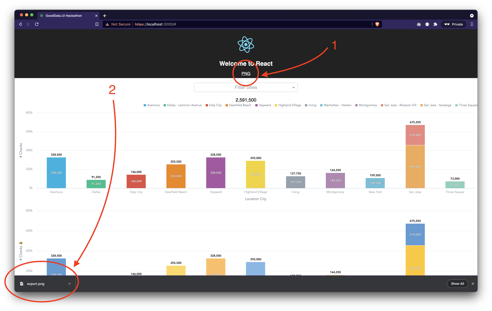

# GoodData.UI html2canvas App

This app shows how to export GoodData.UI charts into PNG. It is only a POC, not thoroughly tested.

## How to run locally

1. `$ git clone https://github.com/gooddata/ui-sdk-examples.git`
1. `$ cd ui-sdk-examples/html2canvas/`
1. `$ npm install`
1. `$ npm start`

## Backend/proxy info

This app is configured to run against https://developer.na.gooddata.com, workspace `xms7ga4tf3g3nzucd8380o2bev8oeknp`. Authentication is required.

## Screenshots

---

This project was bootstrapped with [Create React App](https://github.com/facebookincubator/create-react-app).
