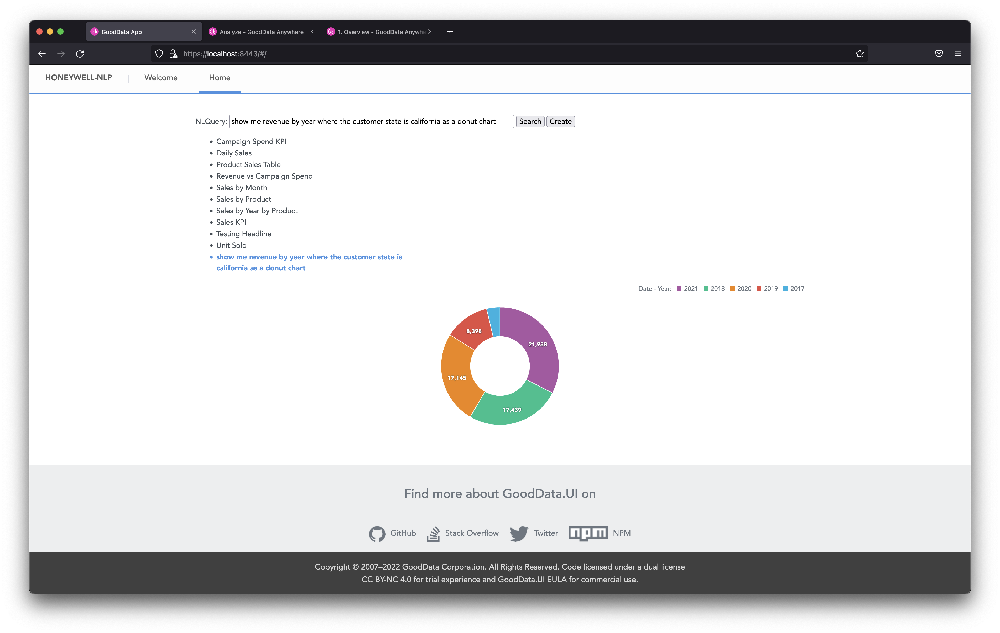

# NLP/NLQ POC

This app connects to GoodData.CN and communicates with a Python server to demonstrate some NLP (Natural Language Processing) and NLQ (Natural Language Querying) functionality.

## Backend

This app typically runs on https://localhost:8443/.

This app connects to a GoodData.CN instance version 1.6.0 with imported layout [gd-cn-layout.json](gd-cn-layout.json). The GoodData.CN instance typically runs on http://localhost:3000/.

This app also communicates with a Python server stored in https://github.com/gooddata/gdc-appstore-pmm/tree/master/nlq_integration. The Python server typically runs on http://localhost:5000/.

## How to run

1. Run the [GoodData.CN CE](https://www.gooddata.com/developers/cloud-native/) (version 1.6.0) on your localhost
    * Import [gd-cn-layout.json](gd-cn-layout.json)
1. Run the Python server on your localhost
    * `python3 app.py`
1. Run this application
    * `yarn install`
    * `REACT_APP_DEV_TIGER_API_TOKEN=<token> yarn start`

### Troubleshooting

**Cannot login to this frontend app**
Experiencing errors and unwanted redirects when trying to visit https://localhost:8443/? Simply start the app with `REACT_APP_DEV_TIGER_API_TOKEN=<token> yarn start` instead of plain `yarn start`.

**Python server at http://localhost:5000 isn't available.**
When visiting http://localhost:5000/search/asdf, the browser says: Access to localhost was denied. This may be caused by [AirPlay Receiver running on port 5000](https://stackoverflow.com/questions/69818376/localhost5000-unavailable-in-macos-v12-monterey). Simply change the port to 5001 in both Python server and this frontend app.

## Examples of use

Try to type one of the following into the NLQuery input and then hit the "Search" button to search for an existing insight, or the "Create" button to generate a new insight:

* give me revenue
* give me revenue by the customer
* give me revenue by the customer name
* give me revenue by the customer name as a line chart
* give me revenue by the customer name as a line chart where the customer state is arizona
* revenue by quarter
* revenue by quarter where customer state is california
* show me revenue by year where the customer state is california as a donut chart

## Browser support

It is recommended to run this web app in **Firefox** as it appears that authentication is somewhat funky in Google Chrome and Brave browsers.

## Screenshot

---

This project was bootstrapped with [GoodData.UI Accelerator Toolkit](https://sdk.gooddata.com/gooddata-ui/docs/create_new_application.html).
