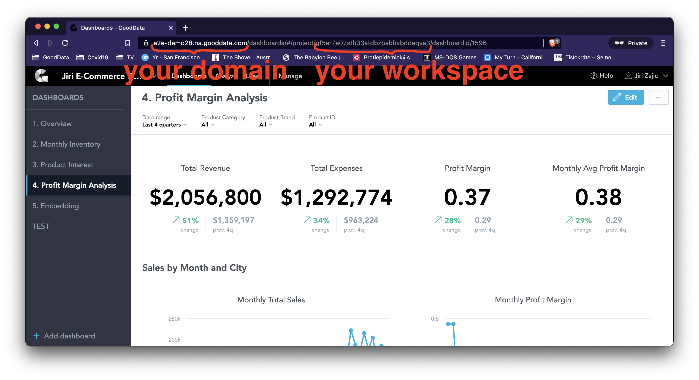

# Configuration

The purpose of running this app on your localhost is that you can alter it to your needs any time you wish. Some places in the code have been designed to make it as easy as possible.

> Please download and install [Visual Studio Code](https://code.visualstudio.com/) for easy files editing before proceeding further.

(Jump back to [INSTRUCTIONS](INSTRUCTIONS.md) or [README](README.md).)

## List of Features

* [Change the domain and workspace](#change-the-domain-and-workspace)
* [Change the name of the application](#change-the-name-of-the-application)
* [Change the URL of the embedded dashboard](#change-the-url-of-the-embedded-dashboard)
* [Change the logo](#change-the-logo)
* [Change the colors](#change-the-logo)
* [Integrate an individual insight](#integrate-an-individual-insight)
* [Integrate a dashboard](#integrate-a-dashboard)

## Opening sales-embedding-demo in Visual Studio Code

* Open VSCode
  * If you don't have VSCode installed, go to https://code.visualstudio.com/, download it and install it
* While in VSCode, at the top of your screen, click View --> Explorer
* Click `Open Folder` and select `sales-embedding-demo` folder to be found in `~/Documents/my-projects/ui-sdk-examples/`
  * Hint: `~` means "home directory", i.e. `~/Documents/…` is the same as `/Users/<your-username>/Documents/…`

---

### Change the Domain and Workspace

* Open sales-embedding-demo in VSCode
  * If you don't know how, click [here](#opening-sales-embedding-demo-in-visual-studio-code) and then return back here
* While in VSCode, click Go --> Go to File… and type in `constants` to open `src/constants.js` file
* Change the value of `backend` to your domain (e.g. https://leilani.internal.gooddata.com)
  * This can be whatever domain you want this Sales Embedding Demo to work against
  * By default it is https://e2e-demo28.na.gooddata.com, but you can change it to anything
  * You most likely want to change it to https://yourname.internal.gooddata.com
* Change the value of `workspace` to the workspace you'll be working with
  * This can be whatever workspace you want this Sales Embedding Demo to work against
  * When you log into platform using the domain URL, the workspace id is part of the URL, check the screenshots below
  * E.g. if you changed your domain to https://leilani.internal.gooddata.com/, when you log in to GoodData platform and navigate to Dashboards, you are redirected to https://leilani.internal.gooddata.com/dashboards/#/project/no6focgukfj3ohfds9dexvkqazugwo, then you want to change worksace to `no6focgukfj3ohfds9dexvkqazugwo`
* Save the changes in `src/constants.js` file (`CMD + S`)
* Restart the app by running `yarn start` again in the Terminal
  * If your app is still running, kill it first with `CTRL + C`, then restart with `yarn start`
* You'll need to `Log out` from the application, and then `Log in` again for changes to take effect
  * When you're loggin in, you now need to use the same credentials that you would when logging to your domain and workspace on GoodData platform

---

### Change the Name of the Application

* Open sales-embedding-demo in VSCode
  * If you don't know how, click [here](#opening-sales-embedding-demo-in-visual-studio-code) and then return back here
* While in VSCode, click Go --> Go to File… and type in `constants` to open `src/constants.js` file
* Change the value of `appName` to from `sales-embedding-demo` to `ShopBoard Demo`
* Save the changes in `src/constants.js` file
* Wait till your app refreshes in your browser (or refresh manually)

---

### Change the URL of the Embedded Dashboard

* In your browser, navigate to the Dashboard that you want to embed
* Click the three horizontal dots in the top right corner, and select "Embed", check the screenshot below
* After choosing your configuration options (e.g. show/hide Navigation panel), select the URL tab and click the `Copy URL` button, again check the screenshot below
* Open sales-embedding-demo in VSCode
  * If you don't know how, click [here](#opening-sales-embedding-demo-in-visual-studio-code) and then return back here
* Open `src/routes/Home.js` in VSCode
* Look for the `iframe` tag
* Replace the value of `src` attribute with the URL in your clipboard (`CMD + V` to paste)

See the [embedding documentation](https://help.gooddata.com/doc/enterprise/en/expand-your-gooddata-platform/gooddata-integration-into-your-application/embed-gooddata-elements-into-your-applications/embed-a-kpi-dashboard#EmbedaKPIDashboard-Advancedconfigurationoptions) for more.

---

### Change the Logo

TODO

---

### Change the Colors

TODO

---

### Integrate an Individual Insight

TODO

---

### Integrate a Dashboard

TODO
