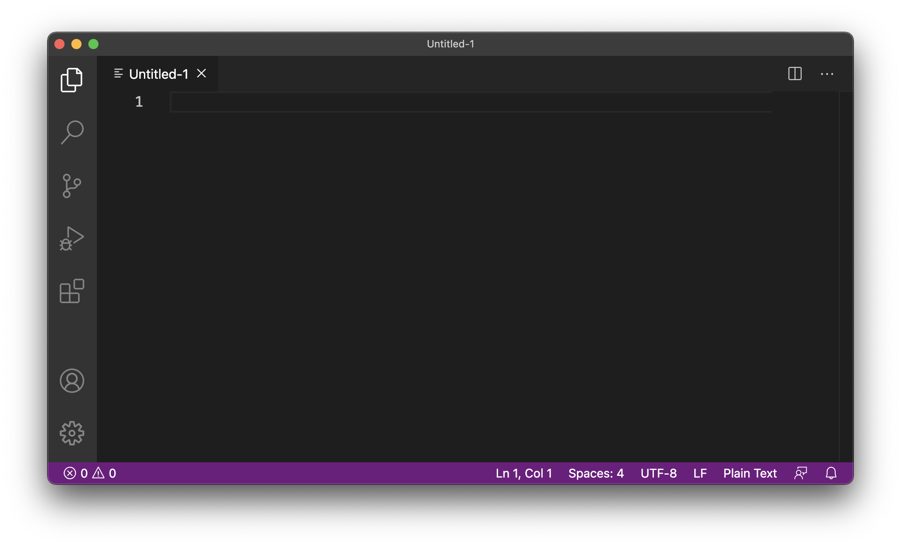
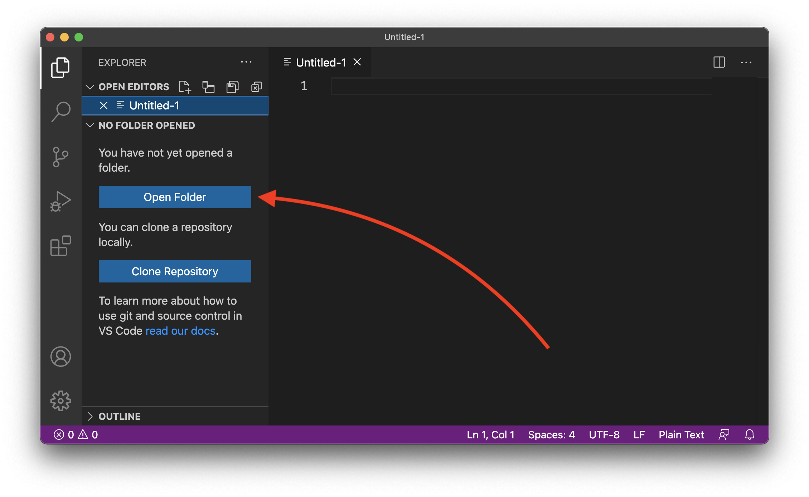
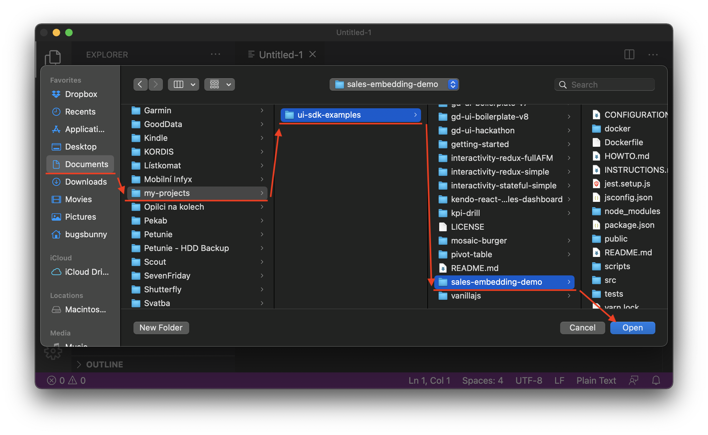
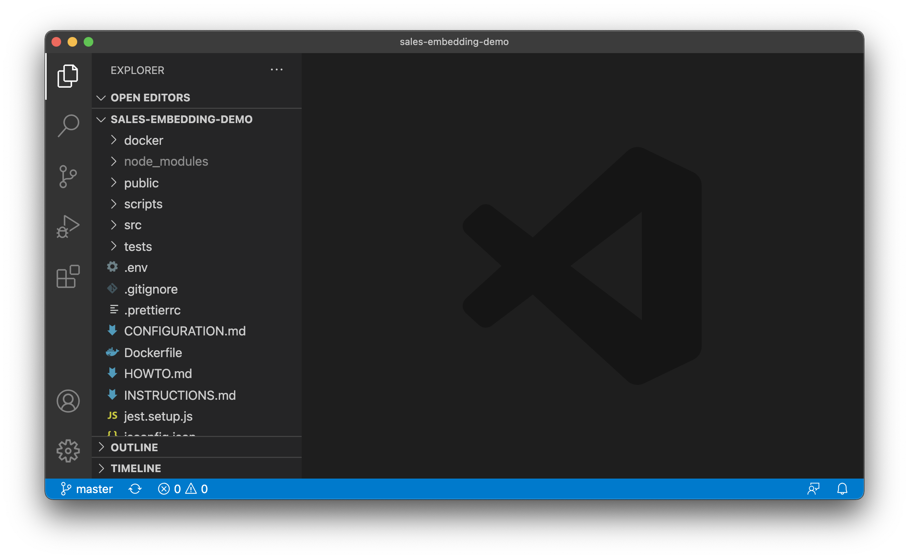
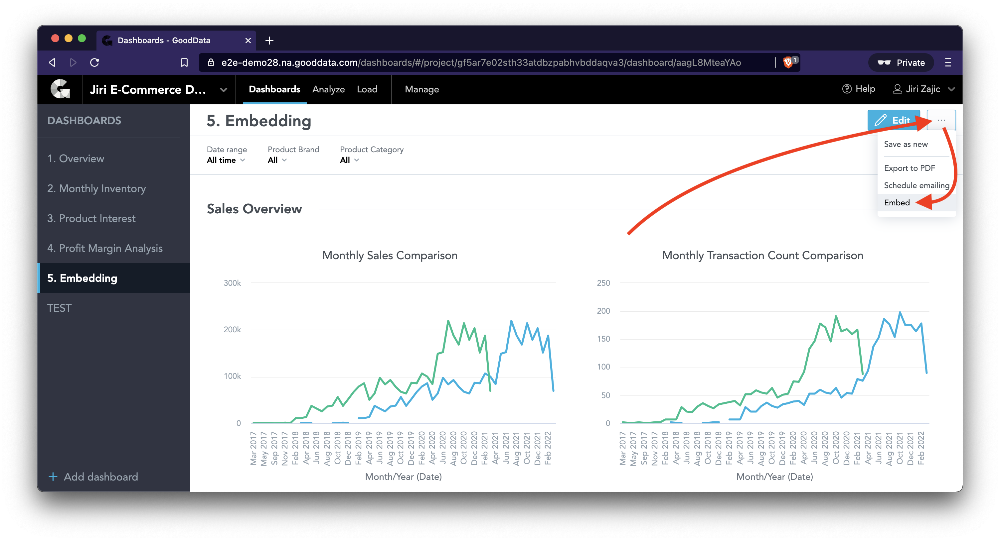
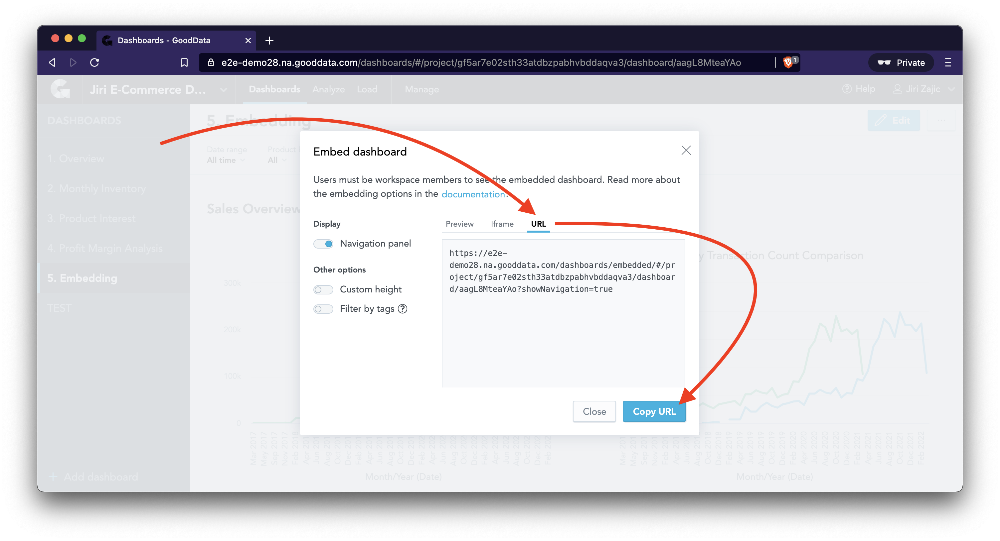

# Configuration

The purpose of running this app on your localhost is that you can alter it to your needs any time you wish. Some places in the code have been designed to make it as easy as possible.

> Please download [Visual Studio Code](https://code.visualstudio.com/) for easy files editing.

(Jump back to [INSTRUCTIONS](INSTRUCTIONS.md) or [README](README.md).)

## List of Features

* [Change the domain and workspace](#change-the-domain-and-workspace)
* [Change the name of the application](#change-the-name-of-the-application)
* [Change the URL of the embedded dashboard](#change-the-url-of-the-embedded-dashboard)
* [Change the logo](#change-the-logo)
* [Change the colors](#change-the-logo)
* [Integrate an individual insight](#integrate-an-individual-insight)
* [Integrate a dashboard](#integrate-a-dashboard)

## Opening sales-embedding-demo in Visual Studio Code

* Open VSCode (if you don't have VSCode, get it at https://code.visualstudio.com/)
* At the top of your screen, click View --> Explorer
* Click `Open Folder` and select `sales-embedding-demo` folder to be found in `~/Documents/my-projects/ui-sdk-examples/`
* You can now open files by clicking Go --> Go to File…

---

### Change the Domain and Workspace

* Kill the app (hit `CTRL + C` in the Terminal)
* [Open sales-embedding-demo in VSCode](#opening-sales-embedding-demo-in-visual-studio-code)
* While in VSCode, click Go --> Go to File… and type in `constants` to open `src/constants.js` file
* Change the value of `backend` to your domain (e.g. https://leilani.na.gooddata.com/)
* Change the value of `workspace` to the workspace you'll be working with
* Save the changes in `src/constants.js` file
* Restart the app (run `yarn start` again in the Terminal)
* You'll now need to `Log out` from the application, and then `Log in` again

---

### Change the Name of the Application

* [Open sales-embedding-demo in VSCode](#opening-sales-embedding-demo-in-visual-studio-code)
* While in VSCode, click Go --> Go to File… and type in `constants` to open `src/constants.js` file
* Change the value of `appName` to from `sales-embedding-demo` to `ShopBoard Demo`
* Save the changes in `src/constants.js` file
* Wait till your app refreshes in your browser (or refresh manually)

---

### Change the URL of the Embedded Dashboard

* In your browser, navigate to the Dashboard that you want to embed
* Click the three horizontal dots in the top right corner, and select "Embed"
* After choosing your configuration options (e.g. show/hide Navigation panel), select URL tab and copy the URL (`CMD + C`)
* [Open sales-embedding-demo in VSCode](#opening-sales-embedding-demo-in-visual-studio-code)
* Open `src/routes/Home.js` in VSCode
* Look for the `iframe` tag
* Replace the value of `src` attribute with the URL in your clipboard (`CMD + V`)

See the [embedding documentation](https://help.gooddata.com/doc/enterprise/en/expand-your-gooddata-platform/gooddata-integration-into-your-application/embed-gooddata-elements-into-your-applications/embed-a-kpi-dashboard#EmbedaKPIDashboard-Advancedconfigurationoptions) for more.

---

### Change the Logo

TODO

---

### Change the Colors

TODO

---

### Integrate an Individual Insight

TODO

---

### Integrate a Dashboard

TODO
