# Instructions for Non-Developers

The following steps will guide you through running this application on your computer for the very first time. The following steps do not aim to explain the basic concepts of frontend development.

> Use at your own risk!

(You can jump back to [README](README.md), or skip forward to [CONFIGURATION](CONFIGURATION.md) if you've done this before.)

## Instructions for MacOS

### Open Terminal

1. Open Spotlight Search (hit `CMD + Spacebar`)
1. Search for `Terminal.app`
1. Hit `Enter`

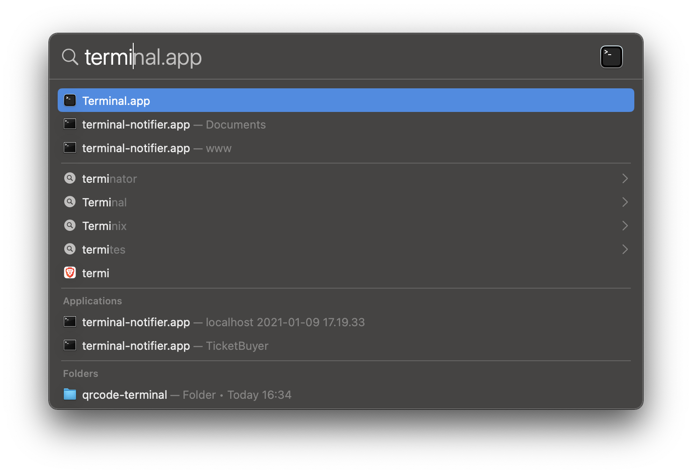

---

### Install brew

Check if you have brew installed on your machine:

* `brew -v`
* (specific version does not matter)

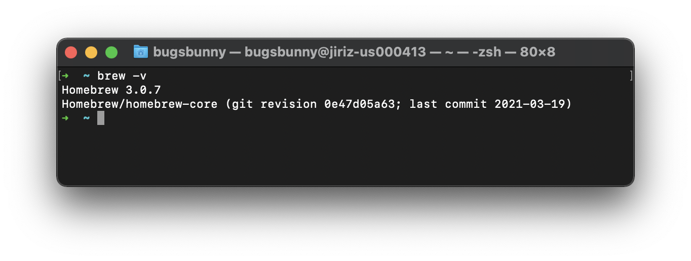

If you have brew installed on your machine, proceed to [installing npm](#install-npm). Otherwise do:

1. Visit https://brew.sh/
1. Copy `/bin/bash -c "$(curl -fsSL https://raw.githubusercontent.com/Homebrew/install/HEAD/install.sh)"` into your clipboard
1. Paste into your Terminal window
1. Hit `Enter`

Confirm that brew installed successfully by running `brew -v`, then proceed to [installing npm](#install-npm).

---

### Install npm

Check if you have npm installed on your machine:

* `npm -v`
* (specific version does not matter)

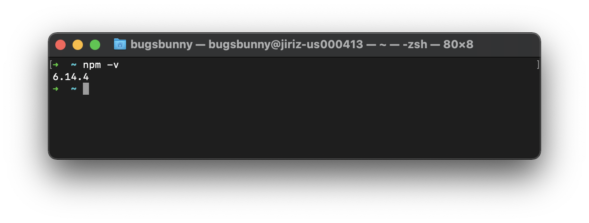

If you have npm installed on your machine, proceed to [installing yarn](#install-yarn). Otherwise do:

* `brew install node`
* (npm will be installed with Node)

Confirm that npm installed successfully by running `npm -v`, then proceed to [installing yarn](#install-yarn).

---

### Install yarn

Check if you have yarn installed on your machine:

* `yarn -v`
* (specific version does not matter)

If you have yarn installed on your machine, proceed to [checking if git is working](#check-that-git-is-working). Otherwise do:

* `npm install -g yarn`

Confirm that yarn installed successfully by running `yarn -v`, then proceed to [checking if git is working](#check-that-git-is-working).

---

### Check that git is working

* `git --version`
* (specific version does not matter)

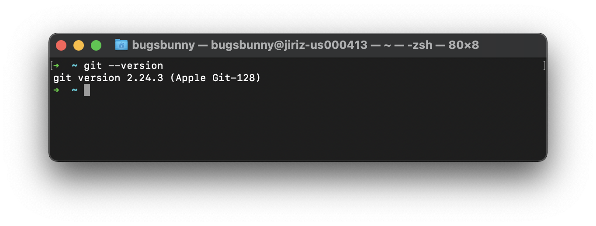

If git is working, proceed to [clonning the repository](#clone-the-repository-and-run-the-app). Otherwise do:

* `xcode-select --install`

Once Xcode command line tools are installed, confirm that git is working by running `git --version`, then proceed to [clonning the repository](#clone-the-repository-and-run-the-app).

---

### Clone the repository and run the app

First, navigate to the folder where you'd like to have this repository clonned. If the folder does not exist, you can create it first, for example:

1. `mkdir ~/Documents/my-projects` (fyi `mkdir` stands for "make directory")
1. `cd ~/Documents/my-projects/` (fyi `cd` stands for "change directory")

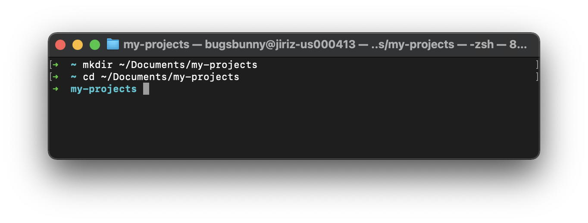

Now, clone the repository, enter the repository folder, enter the project folder, install the dependencies and run the app:

1. `git clone --depth 1 https://github.com/gooddata/ui-sdk-examples.git`
1. `cd ui-sdk-examples/sales-embedding-demo/`
1. `yarn install`
1. `yarn start`

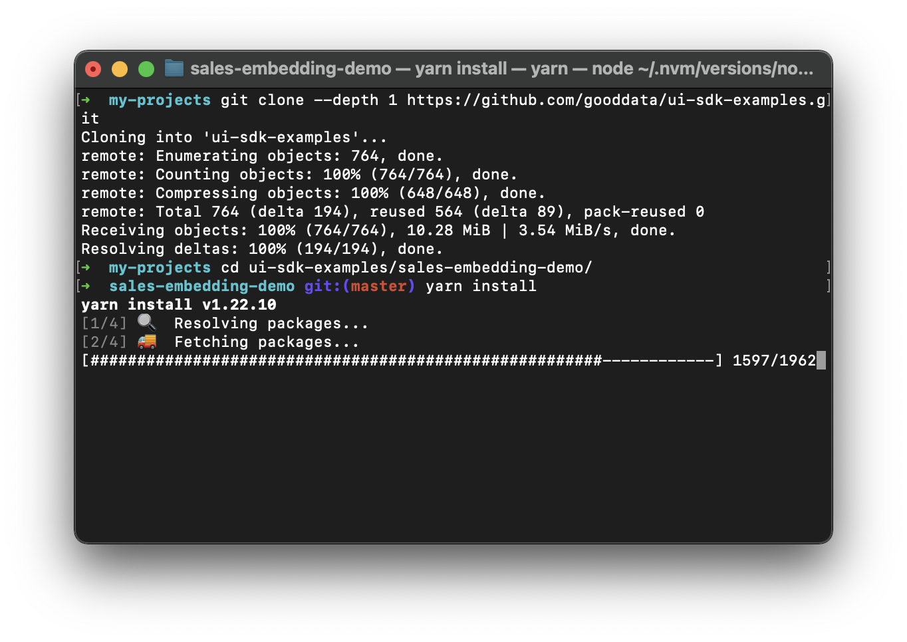
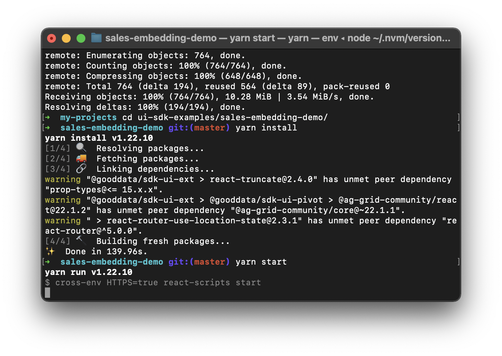
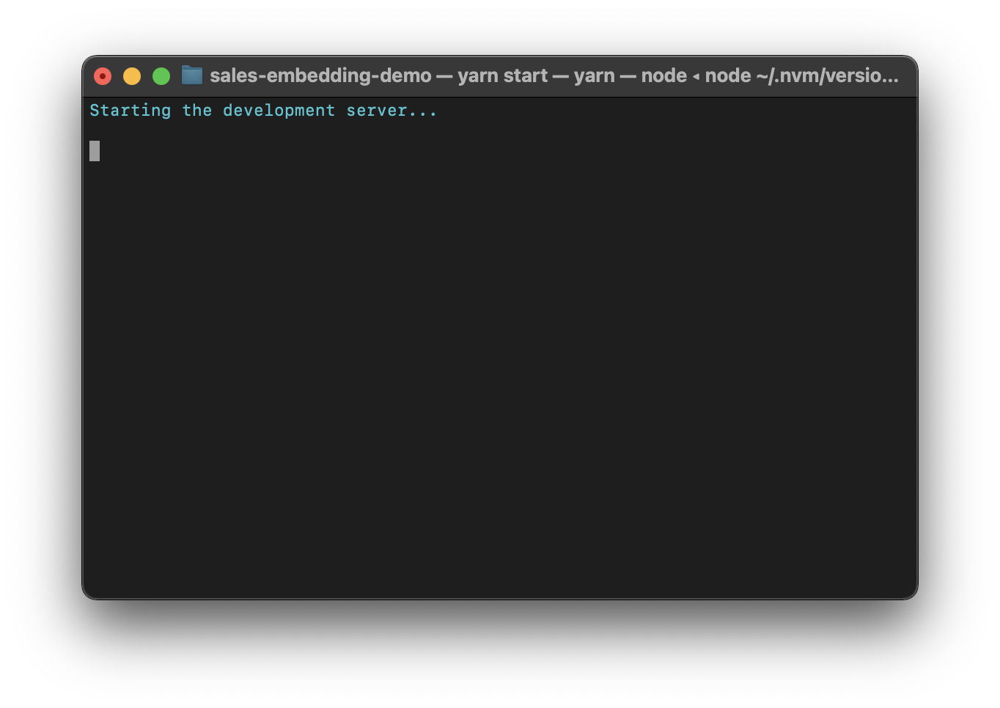
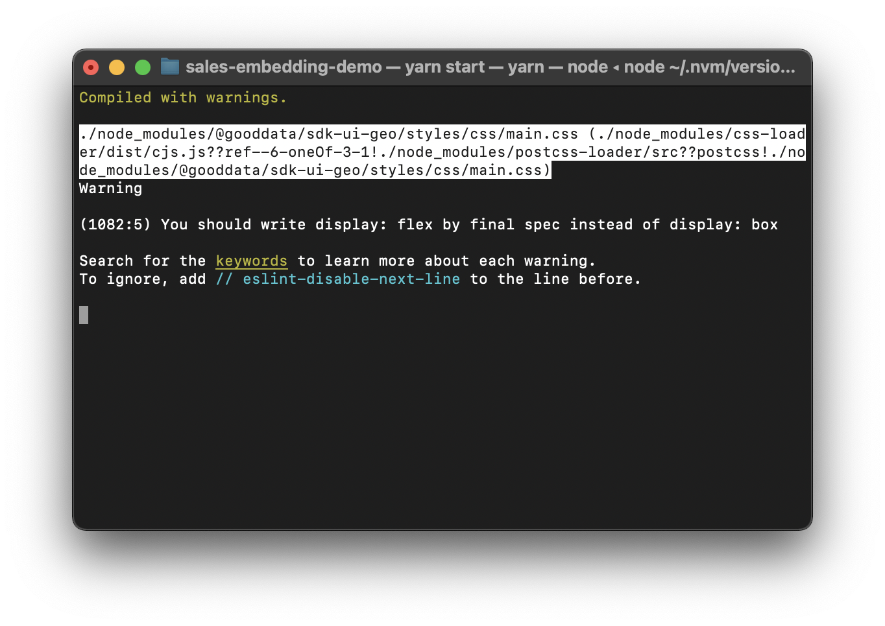

Once the app is started, your browser will most likely warn you that "Your connection is not private." Click on `Advanced` and then `Proceed to localhost (unsafe)`. In case you don't see the the `Advanced` button or the `Proceed to localhost (unsafe)` link, simply click anywhere inside the page and start typing `thisisunsafe`; see https://stackoverflow.com/questions/58802767/no-proceed-anyway-option-on-neterr-cert-invalid-in-chrome-on-macos/58957322 for more.

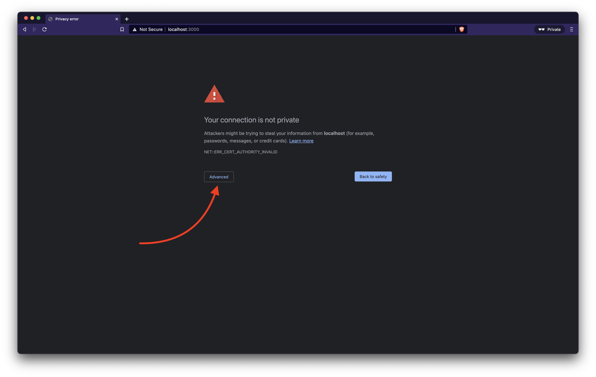
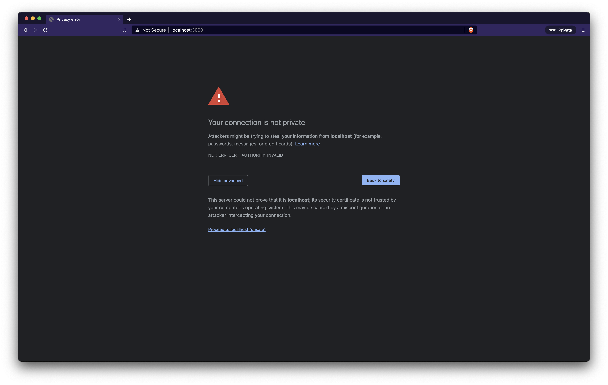

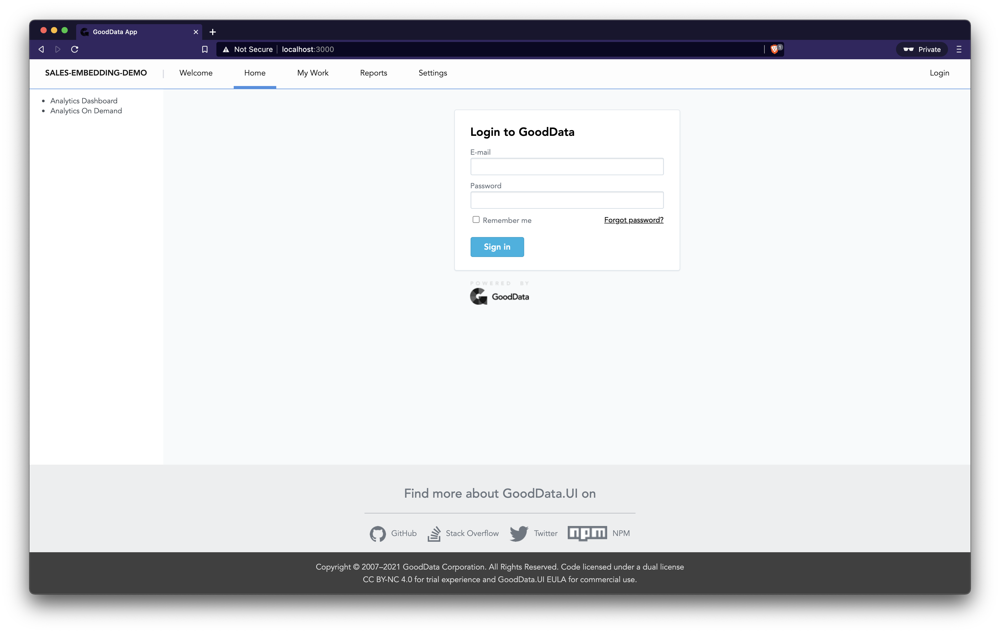

The app should now be running at https://localhost:3000 and you may proceed to [CONFIGURATION](CONFIGURATION.md). Once you're done working with the, you may want to kill it by hitting `CTRL + C` in Terminal.

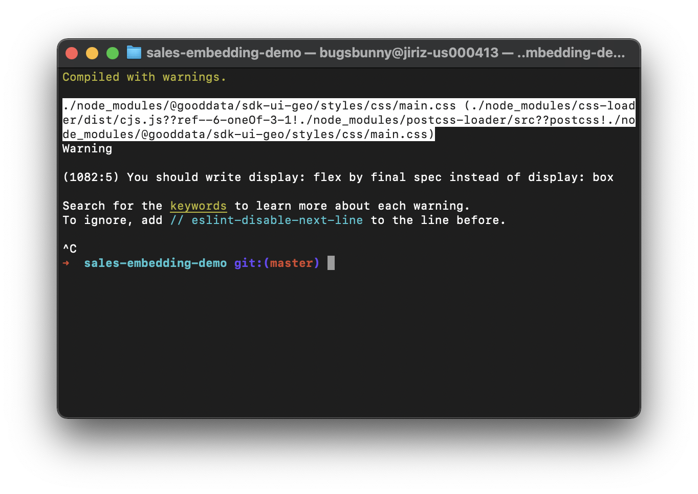

## Instructions for Windows

TODO

## Screenshots

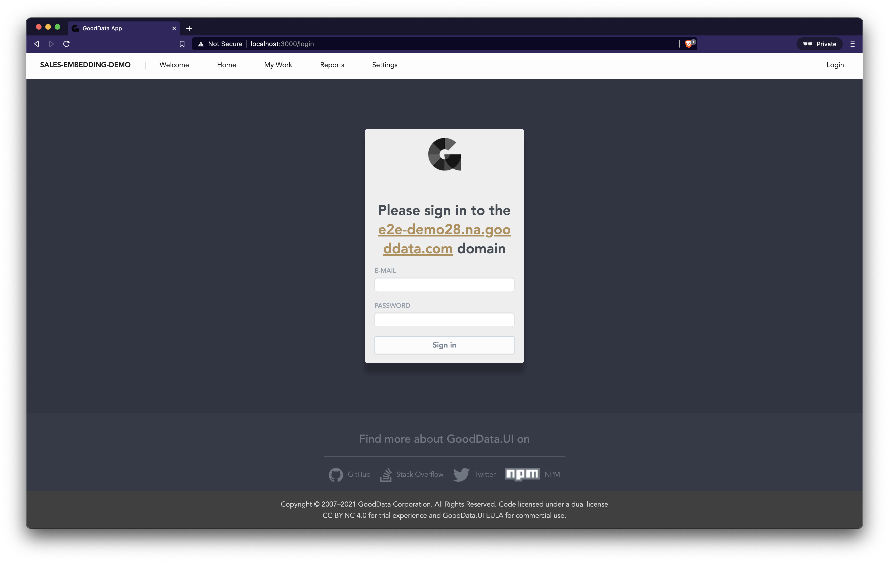
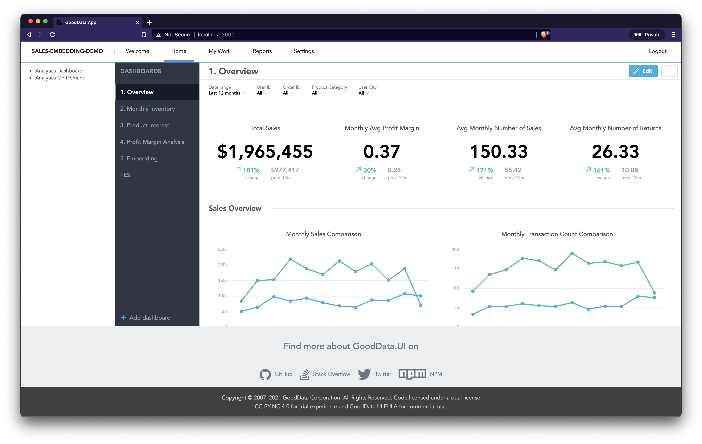
